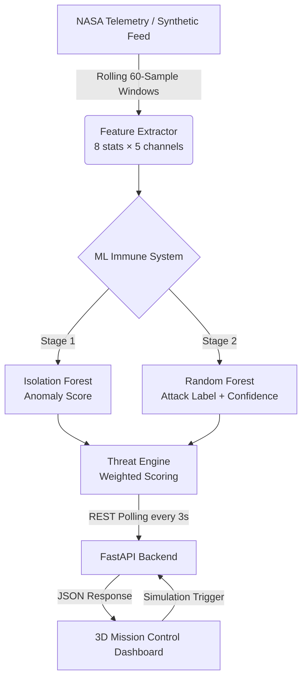

# 🛰️ SatGuard — AI Cyber Immune System for Satellite Networks

> **Protecting Space Assets with Real-Time ML Anomaly Detection and Attack Classification.**
> SatGuard continuously monitors satellite telemetry streams, autonomously identifies anomalous behavior, classifies orbital cyber-threats, and displays everything on a high-fidelity 3D mission control dashboard.

---

## 🏗️ System Architecture



---

## 📂 Project Structure

```text
satguard/
├── train_model.py           ← STEP 1: Trains and saves all ML models
├── requirements.txt         ← Python dependencies
├── README.md
├── data/                    ← Telemetry dataset (auto-generated if missing)
│   ├── train/               ← Training .npy files
│   └── test/                ← Testing .npy files
├── frontend/
│   ├── index.html           ← Three.js 3D Globe + HUD Dashboard
│   └── js/
│       └── api.js           ← Backend integration & live telemetry simulator
└── backend/
    ├── main.py              ← STEP 2: FastAPI server (ML inference + logging)
    └── models/              ← Trained model files (auto-created after training)
        ├── isolation_forest.pkl
        ├── random_forest.pkl
        ├── scaler.pkl
        └── label_map.pkl
```

---

## ⚡ Quick Start

### 1 — Install Dependencies
```bash
pip install -r requirements.txt
```

### 2 — Train the AI Immune Memory
```bash
python train_model.py
```
> **No dataset?** No problem — the script auto-generates realistic synthetic satellite telemetry if `data/train/` or `data/test/` are empty.
> Takes **< 30 seconds**. Saves 4 `.pkl` model files into `backend/models/`.

### 3 — Launch the Backend
```bash
uvicorn backend.main:app --reload --port 8000
```

### 4 — Open the Dashboard
Open **`frontend/index.html`** in any modern web browser. The 3D globe loads instantly. The ML engine auto-connects.

---

## 🤖 ML Intelligence Specification

### Sliding-Window Feature Engineering
SatGuard processes telemetry in **60-sample windows**. For each of 5 channels, **8 statistical signatures** produce a **40-dimensional feature vector**:

| # | Feature | What It Captures |
|:---:|:---|:---|
| 1 | **Mean** | Central tendency |
| 2 | **Std Dev** | Signal volatility |
| 3 | **Min** | Lower bound |
| 4 | **Max** | Upper bound |
| 5 | **Range** | Total signal span |
| 6 | **RMS** | Effective signal power |
| 7 | **Zero-Crossing Rate** | Frequency-domain proxy |
| 8 | **Slope** | Temporal drift direction |

### Two-Stage Defense Pipeline

```
Raw Telemetry → Feature Extraction (40-D) → StandardScaler
    ↓
[Stage 1] Isolation Forest  →  Anomaly? (Yes/No)
                                   ↓ Yes
[Stage 2] Random Forest     →  Attack Label + Confidence
    ↓
Threat Score = (anomaly_metric × 0.6) + (confidence × 0.4)
```

### Attack Vector Coverage

| Class | Attack Type | Signature | Response Action |
|:---:|:---|:---|:---|
| 0 | **Normal** | Baseline telemetry | `MONITORING` |
| 1 | **Signal Injection** | RF channel spikes | `BLOCK TX NODE` |
| 2 | **Command Spoofing** | Cmd frequency bursts | `ISOLATE CHANNEL` |
| 3 | **Telemetry Manipulation** | Gradual sensor drift | `SCRAMBLE COMMS` |

### Threat Level Thresholds
| Score Range | Level |
|:---|:---|
| 0.0 – 0.3 | 🟢 NORMAL |
| 0.3 – 0.6 | 🟡 SUSPICIOUS |
| 0.6 – 1.0 | 🔴 HIGH RISK |

---

## 🔌 API Reference

Explore the interactive Swagger UI at **`http://localhost:8000/docs`**.

| Method | Endpoint | Description |
|:---:|:---|:---|
| `GET` | `/` | Health check & version |
| `GET` | `/status` | Model readiness & incident count |
| `POST` | `/predict` | Run ML inference on telemetry window |
| `GET` | `/simulate/{type}` | Trigger attack scenario |
| `GET` | `/incidents` | Retrieve threat event log |
| `POST` | `/reset` | Flush incident memory |

**Simulate types:** `normal` · `signal_injection` · `cmd_spoofing` · `tele_manipulation`

---

## 🛠️ Technology Stack

| Layer | Technology |
|:---|:---|
| **3D Visualization** | Three.js (r128), CSS3 Glassmorphism |
| **Frontend** | Vanilla JavaScript (ES6+) |
| **Backend** | Python 3.10+, FastAPI, Uvicorn |
| **Anomaly Detection** | Isolation Forest — scikit-learn |
| **Attack Classification** | Random Forest — scikit-learn |
| **Data Pipeline** | NumPy, Pandas, Pickle |

---

## 💡 Enhancement Roadmap

Prioritized ideas to evolve SatGuard beyond hackathon scale:

### 🟢 Tier 1 — Immediate (Days)
- **WebSocket Streaming**: Replace HTTP polling with persistent WebSocket for true real-time updates.
- **Persistent SQLite Log**: Swap the in-memory `incident_log` for a SQLite DB — survives server restarts.
- **Config File**: Move hardcoded thresholds (contamination, window size, threat levels) to a `config.yaml`.

### 🟡 Tier 2 — Short-term (Weeks)
- **LSTM Autoencoder**: Replace Isolation Forest with an LSTM autoencoder for seq-aware anomaly detection.
- **Multi-Satellite Batch Inference**: Single API call that evaluates all 5 satellites at once.
- **Model Versioning & A/B Testing**: Store versioned `.pkl` files so rollback is simple after retraining.
- **Dashboard Mobile View**: Responsive layout for mission control on tablets/smartphones.

### 🔴 Tier 3 — Advanced (Long-term)
- **Graph Neural Networks**: Model the constellation as a graph — detect coordinated multi-satellite attacks.
- **Reinforcement Learning Defense**: Autonomous agent that optimally reroutes, isolates, and scrambles comms.
- **Federated Learning**: On-board satellite models train locally; only gradient updates are shared.
- **Real TLE Integration**: Use live Two-Line Elements from the [Celestrak API](https://celestrak.org/) to render real orbital positions.

---

> [!IMPORTANT]
> SatGuard is a hackathon prototype. It is **not** connected to real satellites.

---

*Inspired by the 2022 Viasat cyberattack — built to detect threats before they escalate.*